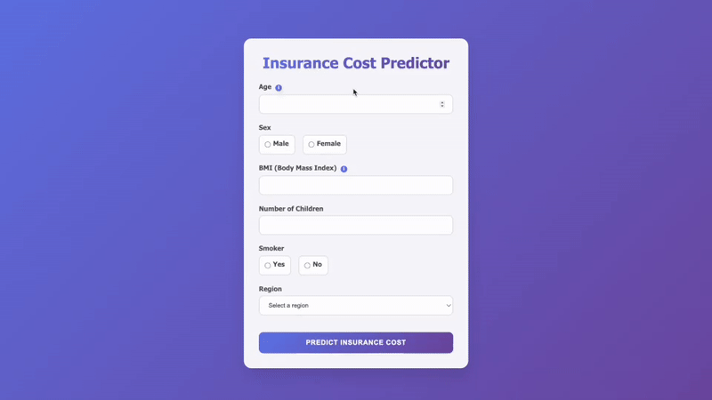

# Medical Insurance Cost Predictor 🏥💰

A machine learning web application that predicts medical insurance costs based on demographic and health factors. The application features a modern, interactive frontend with a Flask API backend serving a trained neural network model.

## ✨ Features

- **Interactive Web Interface**: Modern, responsive UI with smooth animations
- **Real-time Predictions**: Get instant insurance cost estimates
- **RESTful API**: Flask backend with JSON endpoints
- **Dockerized Deployment**: Easy setup and deployment with Docker
- **Machine Learning Model**: Neural network trained on insurance data with log transformation

## 🚀 Demo



*Enter your details and get an instant insurance cost prediction*

## 📊 Model Details

- **Algorithm**: Neural Network
- **Features**: Age, Sex, BMI, Children, Smoker Status, Region
- **Target**: Medical Insurance Charges (log10 transformed)
- **Framework**: scikit-learn
- **Performance**: [Add your model metrics here]

### Input Features:
- **Age**: 18-100 years
- **Sex**: Male/Female
- **BMI**: Body Mass Index (15-50)
- **Children**: Number of dependents (0-10)
- **Smoker**: Yes/No
- **Region**: Northeast, Northwest, Southeast, Southwest (US)

## 🏗️ Architecture

```
┌─────────────────┐    HTTP/JSON    ┌─────────────────┐
│   Frontend      │ ──────────────→ │   Backend       │
│   (HTML/JS)     │                 │   (Flask API)   │
│   Port: 3000    │ ←────────────── │   Port: 5010    │
└─────────────────┘                 └─────────────────┘
                                            │
                                            ▼
                                    ┌─────────────────┐
                                    │   ML Model      │
                                    │   (.pkl file)   │
                                    └─────────────────┘
```

## 🐳 Quick Start with Docker

### Prerequisites
- Docker and Docker Compose installed
- Git

### 1. Clone the repository
```bash
git clone https://github.com/omarsinno54/insurance-cost-predictor.git
cd insurance-cost-predictor
```

### 2. Build and run with Docker Compose
```bash
docker-compose up --build
```

### 3. Access the application
- **Frontend**: http://localhost:3000
- **API**: http://localhost:5010
- **Health Check**: http://localhost:5010/health

## 🧪 Testing the API

### Using curl commands:

**Health Check:**
```bash
curl http://localhost:5010/health
```
Expected response:
```json
{
  "model_loaded": true,
  "status": "healthy"
}
```

**Make a Prediction:**
```bash
curl -X POST http://localhost:5010/predict \
  -H "Content-Type: application/json" \
  -d '{
    "age": 30,
    "sex": "male",
    "bmi": 25.5,
    "children": 2,
    "smoker": "no",
    "region": "northeast"
  }'
```
Expected response:
```json
{
  "prediction": 5444.925698040062,
  "status": "success"
}
```

### Using the Web Interface:

1. Go to http://localhost:3000
2. Fill out the insurance form with your details
3. Click "Predict Insurance Cost"
4. See your estimated annual insurance cost


## 📁 Project Structure

```
insurance-cost-predictor/
├── README.md
├── docker-compose.yml    # Multi-container orchestration
├── .gitignore
├── Makefile              # Makefile including MLflow
│
├── backend/ # Flask API backend
│   ├── Dockerfile
│   ├── requirements.txt
│   ├── app.py            # Flask API server
│   ├── model.pkl         # Trained ML model
│   └── Makefile          # Makefile used in Docker container
│
└── frontend/             # Web interface
    ├── Dockerfile
    ├── nginx.conf        # Nginx configuration
    └── index.html        # Interactive web interface
```

## 🔧 API Reference

### `GET /health`
Check API health status.

**Response:**
```json
{
  "status": "healthy",
  "model_loaded": true
}
```

### `POST /predict`
Predict insurance cost for given parameters.

**Request Body:**
```json
{
  "age": 30,
  "sex": "male",
  "bmi": 25.5,
  "children": 2,
  "smoker": "no",
  "region": "northeast"
}
```

**Response:**
```json
{
  "prediction": 5444.925698040062,
  "status": "success"
}
```
**Parameters:**
- `age`: Integer (18-100)
- `sex`: String ("male" or "female")  
- `bmi`: Float (15.0-50.0)
- `children`: Integer (0-10)
- `smoker`: String ("yes" or "no")
- `region`: String ("northeast", "northwest", "southeast", "southwest")
```

## 🐛 Troubleshooting

### Common Issues

**1. "Docker command not found"**
```bash
# Check Docker installation
docker --version
docker-compose --version

# On macOS, if Docker Desktop is installed but command not found:
echo 'export PATH="/Applications/Docker.app/Contents/Resources/bin:$PATH"' >> ~/.zshrc
source ~/.zshrc
```

**2. "Port already in use"**
If you see port conflict errors, change the ports in `docker-compose.yml`:
```yaml
services:
  backend:
    ports:
      - "5011:5010"  # Use different external port
  frontend:
    ports:
      - "3001:80"    # Use different external port
```
Then access via http://localhost:3001 and http://localhost:5011

**3. "Model file not found"**
Ensure your `.pkl` model file is in the `backend/` directory with the correct name in `app.py`.

**4. Changes not reflecting**
Always rebuild after making changes:
```bash
docker-compose down && docker-compose up --build
```

**5. "Failed to load resource: net::ERR_NAME_NOT_RESOLVED"**
Check that the frontend JavaScript is using the correct URL format:
```javascript
// Correct (with colon after http):
fetch('http://localhost:5010/predict', ...)

// Wrong (missing colon):
fetch('http//localhost:5010/predict', ...)
```

## 📝 What This Project Demonstrates

This project showcases:
- **Machine Learning Model Deployment**: Serving ML models via REST API
- **Containerization**: Docker and Docker Compose for consistent environments
- **Full-Stack Development**: Frontend interface + Backend API
- **Data Processing**: Log transformation for skewed target variables
- **Production Considerations**: Health checks, proper error handling, CORS

----
## 🛠️ Development

## Model Training
The neural network model was trained with the following preprocessing:
- **Target transformation**: `log10(charges)` to handle right-skewed distribution
- **Feature encoding**: Categorical variables encoded appropriately
- **Validation**: [Add your validation approach]

To retrain the model, feel free to explore the attached jupyter notebook `notebook.ipynb`, or write your own script!


### 📈 Performance Metrics
| Metric   | Value  |
|----------|--------|
| R² Score | 0.85   |
| MAE      | 0.09   |


## 📊 Data Information

### Training Data
- **Dataset Size**: 1338 rows
- **Features**: 6 input features
- **Target**: Insurance charges (USD)

### Feature Importance
1. **Smoker Status** - Highest impact on premiums
2. **Age** - Strong positive correlation
3. **BMI** - Significant for high BMI values
4. **Region** - Regional cost variations
5. **Children** - Moderate impact
6. **Sex** - Minor statistical difference

## Using Makefile
To have cleaner structure, CLI commands were set in a Makefile
```bash
# Run application
make app

# Format code
make format

# Install dependencies
make install

# Run mlflow server
make mlflow
```

## Using MLflow
The project includes MLflow to log model hyperparameters, metrics and artifacts. The MLflow UI provides an impressive dashboard to compare model performance.


## 👨‍💻 Author

**Omar Sinno**
- GitHub: [@omarsinno54](https://github.com/omarsinno54)
- LinkedIn: [@omarhsinno](https://linkedin.com/in/omarhsinno)
- Email: omarsinno54@gmail.com

## 🙏 Acknowledgments

- Dataset: Kaggle @"mosapabdelghany/medical-insurance-cost-dataset"

## DOI Citation
```
@misc{mosap_abdelghany_2025,
	title={Medical Insurance Cost Dataset},
	url={https://www.kaggle.com/dsv/12853160},
	DOI={10.34740/KAGGLE/DSV/12853160},
	publisher={Kaggle},
	author={mosap abdelghany},
	year={2025}
}
```

## License
[CC0: Public Domain](https://creativecommons.org/publicdomain/zero/1.0/)

---